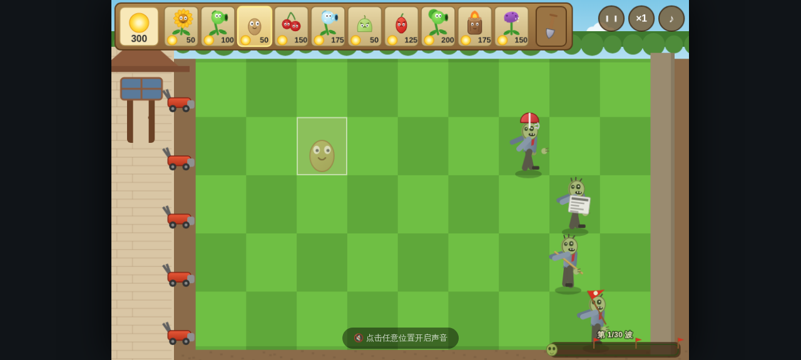

# 🌱 web-pvz — 植物大战僵尸 Web 版

基于 **HTML5 Canvas + Web Audio** 的《植物大战僵尸》Web 复刻版。
**零外部素材**：所有画面均为运行时程序化矢量绘制，所有音乐音效均为运行时合成，打包后仅 **约 170 KB** 单 HTML 文件，双击即玩。



## 🎮 玩法内容

| 模块 | 内容 |
|------|------|
| 植物 | 12 种：向日葵、豌豆射手、坚果墙、土豆雷、樱桃炸弹、雪花豌豆、倭瓜、火爆辣椒、双发射手、火炬树桩、大嘴花、高坚果 |
| 僵尸 | 7 种：普通、路障、铁桶、撑杆跳、报纸、橄榄球、旗帜（大波先锋） |
| 关卡 | 冒险模式 5 关（波次 10→30 递增）+ 无尽模式（通关第 5 关解锁） |
| 系统 | 阳光经济、种子冷却、铲子、割草机、波次进度条、旗帜大波、图鉴、设置、localStorage 存档 |

- 快捷键：`P` 暂停 · `F` 2 倍速 · `M` 静音 · `Esc` 取消选择
- 支持 PC 鼠标与移动端触屏（拖动可顺路收集阳光）

## 🔧 数值与机制来源（致敬复刻）

本项目的游戏机制与数值参考了以下开源复刻项目的实现：

- **[wszqkzqk/PvZ-Portable](https://github.com/wszqkzqk/PvZ-Portable)**（C++ 复刻）
  - 普通僵尸 270 血、路障锥 370 血、铁桶 1100 血（`src/Lawn/Zombie.cpp`）
  - 僵尸随机速度 0.23~0.37 px/frame、冰冻减速系数 0.4（`CHILLED_SPEED_FACTOR`）
- **[hsk-dream/PVZ-Godot-Dream](https://github.com/hsk-dream/PVZ-Godot-Dream)**（Godot 复刻）
  - 向日葵首次产阳光 3~12.5s 随机、后续 23.5~25s、25 阳光/颗（`component_create_sun.gd`）
  - 每 10 波生成旗帜大波、关卡参数结构（`level_data.gd`）

> ⚠️ PVZ-Godot-Dream 仓库已因版权原因删除原版美术/音乐资源，因此本项目美术全部为**原创程序化绘制**，音乐为**原创合成旋律**（风格致敬），不含任何 PopCap 原版素材。本作品为开源学习项目，植物大战僵尸正版版权归 PopCap/EA 所有。

## 📦 运行方式

**方式一（推荐）：** 直接下载 [dist/web-pvz.html](dist/web-pvz.html)（或 Release 附件），双击用浏览器打开即玩，无需服务器。

**方式二：** 源码运行

```bash
git clone https://github.com/43aquarius/web-pvz.git
cd web-pvz
python3 -m http.server 8000
# 浏览器打开 http://localhost:8000
```

**打包单文件：**

```bash
python3 tools/build.py            # 输出 dist/web-pvz.html
```

## 📁 目录结构

```
web-pvz/
├── index.html          # 开发版入口（引用外部 JS）
├── js/
│   ├── util.js         # 工具（随机/数学/画布辅助/存档）
│   ├── audio.js        # Web Audio 合成引擎（BGM 序列器 + 20+ 音效）
│   ├── data.js         # 数值表（植物/僵尸/关卡/波次预算）
│   ├── sprites.js      # 程序化绘制：场景、植物、阳光、子弹、UI
│   ├── sprites_z.js    # 程序化绘制：7 种僵尸 + 行走/啃食/死亡动画
│   ├── entities.js     # 实体类（植物/僵尸/子弹/阳光/割草机/粒子）
│   ├── board.js        # 棋盘（网格/波次/爆炸/胜负/战场渲染）
│   ├── scenes.js       # 场景（标题/选关/选卡/图鉴/设置/战斗）
│   └── main.js         # 入口（固定步长循环/输入/存档/快捷键）
├── tools/build.py      # 单文件打包脚本
└── dist/web-pvz.html   # 打包产物（~170KB 单文件）
```

## 🛠️ 技术要点

- **纯 Canvas 2D 程序化渲染**：植物/僵尸为参数化矢量绘制（骨骼式摆动、啃食张颌、死亡前倾+头颅脱落、冰冻变蓝等动画）
- **Web Audio 合成音乐**：内置 3 首原创循环曲目（白天战斗 D 小调 132BPM / 夜晚八音盒 / 菜单圆舞曲），由振荡器序列器实时演奏
- **固定时间步长游戏循环**（60Hz 累加器），支持 2 倍速
- **信箱式自适应缩放** + DPR 高清渲染
- 单文件构建：正则内联所有 JS，无任何外部依赖，`file://` 协议直接可玩

## 📄 许可

代码以 [MIT License](LICENSE) 开源。游戏机制为对经典玩法的学习复刻；美术与音乐为本项目原创程序化生成内容。
